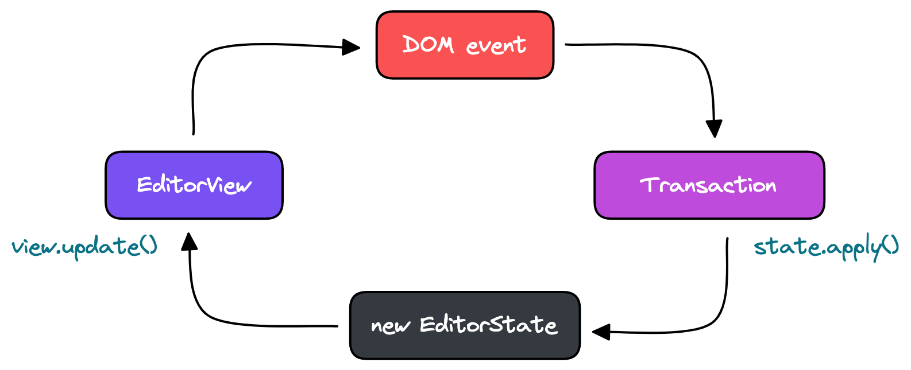

# Prosemirror Async Query


A declarative API for using promises in prosemirror plugins.

[Live Demo](https://prosemirror-async-query.vercel.app/)

## Installation

```sh
# npm
npm install prosemirror-async-query

# yarn
yarn add prosemirror-async-query
```

## Documentation

This documentation assumes you have some familiarity with prosemirror.
If you do not know about Prosemirror Plugins, in particular, methods such as `view.update`, `state.apply`, and `state.init` then you may want to start by reading the [Prosemirror Guide](https://prosemirror.net/docs/guide/).

### Motivation

In the normal prosemirror data flow, the "editor displays editor state, and when something happens, it creates a transaction and broadcasts this. This transaction is then, typically, used to create new state, which is given to the view using its update state method" [^1].

[^1]: quoted from [the prosemirror guide](https://prosemirror.net/docs/guide/#view.data_flow).



The naive way to add promises to this data flow is to set up the promise in `state.apply()` and then `await` the promise in `view.update()`.
[This pattern shows up in the real world](https://github.com/ueberdosis/tiptap/blob/fadafae498eb21253c92047f249b706b78319797/packages/suggestion/src/suggestion.ts#L106-L111) but it has a couple of issues.

- Because the view only updates when the promise returns, the user is unaware that anything is happening until the promise returns. This could be a usability issue if the promise takes longer than a couple of milliseconds.
- If a transaction leads to a new promise, you may want to cancel the currently running promise, but creating communication between a `state.apply()` and a previous `view.update()` goes against the normal prosemirror data flow.

### How it Works

`prosemirror-async-query` enables easy integration of promises in prosemirror plugins by exposing a declarative API for keeping track of promise state using transactions and view updates.

To start you create a query in `state.apply()` and add it to your plugin state.
The query constructor must have at least a `query` function that returnse a promise that resolves data or throws an error.

```tsx
import { AsyncQuery } from "prosemirror-async-query";
import { Plugin } from "prosemirror-state";

const plugin = new Plugin({
  state: {
    init() {
      return { query: null };
    },
    apply(tr, prev) {
      // if the query does not exist create it.
      if (prev.query === null) {
        return {
          query: new AsyncQuery({ query: fetchTodos }),
        };
      }
      return prev;
    },
  },
});
```

Having a query in your plugin state does not do anything yet.
The next step is to run the query using the query's `viewUpdate` and `viewDestroy` methods.
These are meant to be called in the plugin's `view.update()` and `view.destory()` methods respectively.

```tsx
import { AsyncQuery } from "prosemirror-async-query";
import { Plugin, PluginKey } from "prosemirror-state";

const plugin = new Plugin({
  // use a plugin key so we can access plugin state
  key: new PluginKey("async-query-plugin"),
  view() {
    update(editor) {
      // run the query update method
      pluginKey.getState(editor.state)?.query?.viewUpdate(editor);
    },
    destroy() {
      // run the query destroy method
      pluginKey.getState(editor.state)?.query?.viewDestroy(editor);
    }
  },
  state: {
    init() {
      return { query: null };
    },
    apply(tr, prev) {
      if (prev.query === null) {
        return {
          query: new AsyncQuery({query: fetchTodos}),
        };
      } else {
        // check the query status (we'll improve this in a second)
        console.log(prev.query.status)
      }
      return prev;
    },
  },
});
```

Before you continue it is helpful to be aware of what the `query.status` means.

- `idle` means the query exists but the query function has not been run or the query is not enabled (to learn about enabled check the [AsyncQuery Code](lib/AsyncQuery.tsx))
- `loading` means the query is fetching but has not returned yet
- `error` means the query was canceled or encountered an error
- `success` means the query returned successfully and has data

When you create a new query with `AsyncQuery()` the query has a status of `idle`.
When you call `viewUpdate` on a query, the method checks to see if the query has an `idle` status.
If the query status is `idle` the `viewUpdate` method runs the query and dispatches transactions when the query status changes to `loading`, `error`, or `success`.

We can already access the `query` status in `state.apply()` but this is a bit crude.
There are many transactions and we probably want to do things exactly when the query status changes, not on every transaction.
Luckily `AsyncQuery` makes this easy using the `statusChanged` method.

```tsx
import { AsyncQuery } from "prosemirror-async-query";
import { Plugin, PluginKey } from "prosemirror-state";

const plugin = new Plugin({
  key: new PluginKey("async-query-plugin"),
  view() {
    update(editor) {
      pluginKey.getState(editor.state)?.query?.viewUpdate(editor);
    },
    destroy() {
      pluginKey.getState(editor.state)?.query?.viewDestroy(editor);
    }
  },
  state: {
    init() {
      return { query: null };
    },
    apply(tr, prev) {
      if (prev.query === null) {
        return {
          query: new AsyncQuery({query: fetchTodos}),
        };
      // check if the query status changed
      } else if (prev.query.statusChanged(tr)) {
        console.log("query status changed", prev.query.status);
      }
      return prev;
    },
  },
});
```

The `statusChanged` method only returns true for transactions dispatched by the query's `viewUpdate` method.

We now have a straightforward way of defining an asynchronous function in `state.apply()`, running the asynchronous function in `view.update()`, and reacting to changes in the asynchronous function in `state.apply()`.

### Getting Fancy

As a final tip, both `statusChanged` and `viewUpdate` take flags which can help you control the data flow.
For example, maybe you don't care about the `loading` state and you want to avoid sending extraneous transactions.
You can filter loading transactions by passing `ignoreLoading` to `viewUpdate`.
There are similar flags for `error`, `canceled`, and `success`.

When checking `statusChanged` you may want to handle specific statuses.
You can do this by passing a `status` value (either a string or array) to the `statusChanged` function.

```tsx
import { AsyncQuery } from "prosemirror-async-query";
import { Plugin, PluginKey } from "prosemirror-state";

const plugin = new Plugin({
  key: new PluginKey("async-query-plugin"),
  view() {
    update(editor) {
      pluginKey.getState(editor.state)?.query?.viewUpdate(
        editor,
        // don't send transactions for queries that are loading or errored
        {ignoreLoading: true, ignoreError: true}
      );
    },
    destroy() {
      pluginKey.getState(editor.state)?.query?.viewDestroy(editor);
    }
  },
  state: {
    init() {
      // added a query result to our state
      return { query: null, result: null };
    },
    apply(tr, prev) {
      if (prev.query === null) {
        return {
          query: new AsyncQuery({query: fetchTodos}),
        };
      // only handle the success case
      } else if (prev.query.statusChanged(tr, "success")) {
        console.log("query returned successfully");
        return {
          ...prev,
          result: query.data,
        }
      }
      return prev;
    },
  },
});
```

For more in depth documentation check out the comments in the [source code](lib/AsyncQuery.tsx) as well as the [example usage](src/AsyncFlowExtension.tsx) from the demo.
